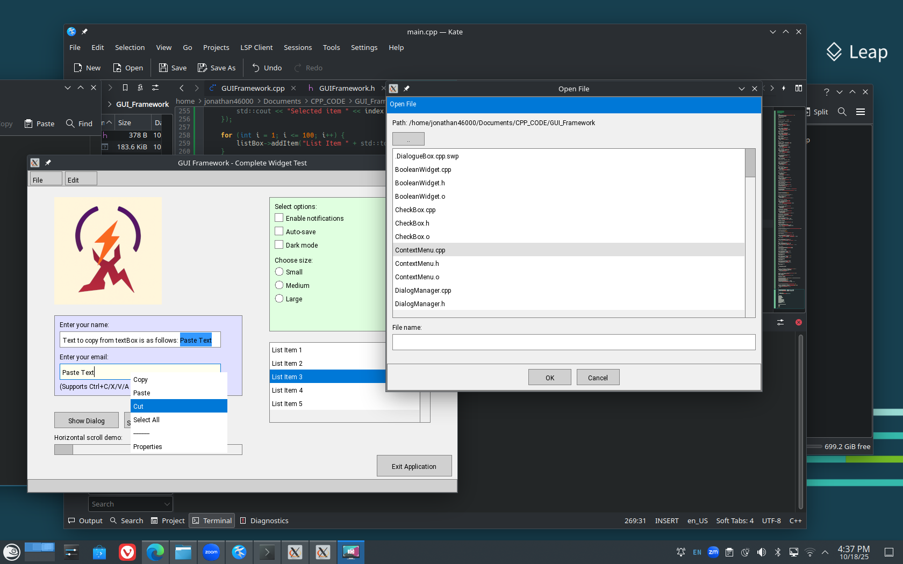
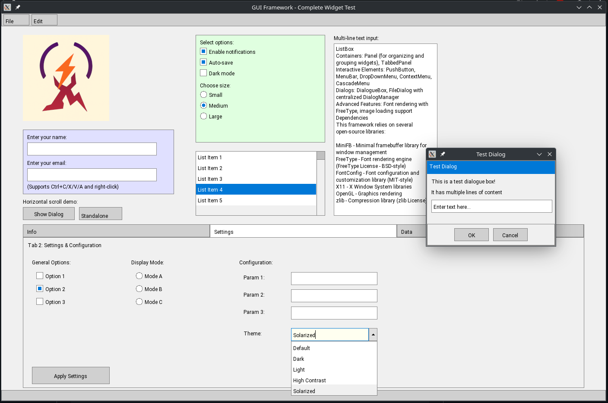

# GUI Framework


A lightweight, modern C++ GUI framework for Linux built on top of MiniFB with comprehensive widget support.

## Features





This framework provides a complete set of widgets for building desktop applications:

- **Input Widgets**: TextBox, MultiLineTextBox, CheckBox, RadioButton, ScrollBar, ComboBox
- **Display Widgets**: TextLabel, ImageWidget, ListBox
- **Containers**: Panel (for organizing and grouping widgets), TabbedPanel
- **Interactive Elements**: PushButton, MenuBar, DropDownMenu, ContextMenu, CascadeMenu
- **Dialogs**: DialogueBox, FileDialog with centralized DialogManager
- **Advanced Features**: Font rendering with FreeType, image loading support

## Dependencies

This framework relies on several open-source libraries:

- **MiniFB** - Minimal framebuffer library for window management
- **FreeType** - Font rendering engine (FreeType License - BSD-style)
- **FontConfig** - Font configuration and customization library (MIT-style)
- **X11** - X Window System libraries
- **OpenGL** - Graphics rendering
- **zlib** - Compression library (zlib License)

## Building

Requirements:
- C++17 compatible compiler
- Development packages for: MiniFB, FreeType, FontConfig, X11, OpenGL

Build with:
```bash
make
```

The executable will be created in `bin/gui_app`.

Clean build artifacts:
```bash
make clean
```

## License

This framework uses permissive open-source licenses:
- Primary codebase: **MIT License**
- Some components may use other permissive licenses (BSD, zlib, etc.)

All dependencies use permissive licenses compatible with commercial and open-source use. See individual library documentation for specific license details.

## Usage

See `main.cpp` for a comprehensive example demonstrating all available widgets and features.
